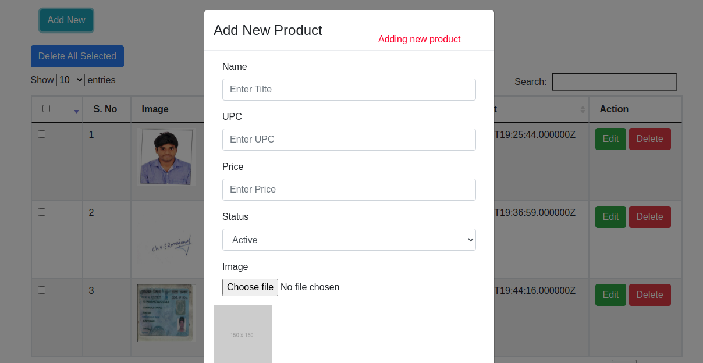
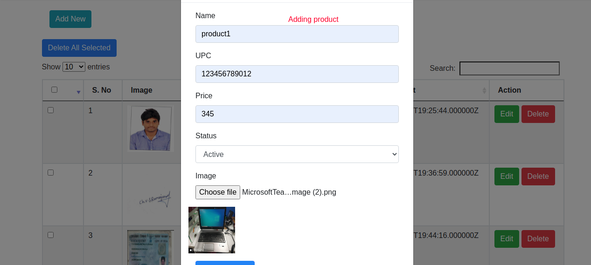
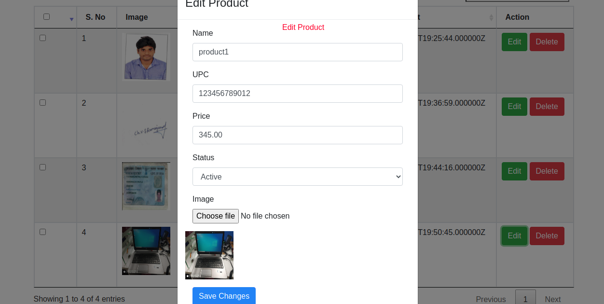
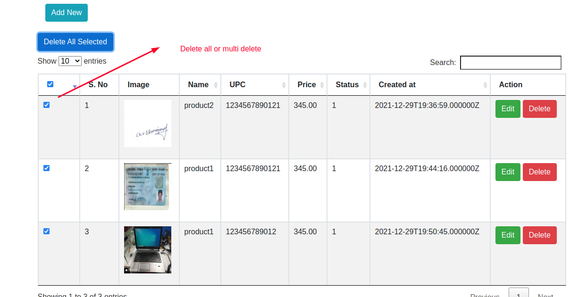

Maltego Test Install Steps

## About Dublin App install steps...

This App is used for Create Read,Update and delete  with multiple delete available

## Installation Steps

1. git clone -b main https://github.com/vschavala/crud-app.git

2. install Docker in you system

3. got to project path cd /projectpath

4. docker-compose build 

5. docker-compose up -d

## Screen shots

